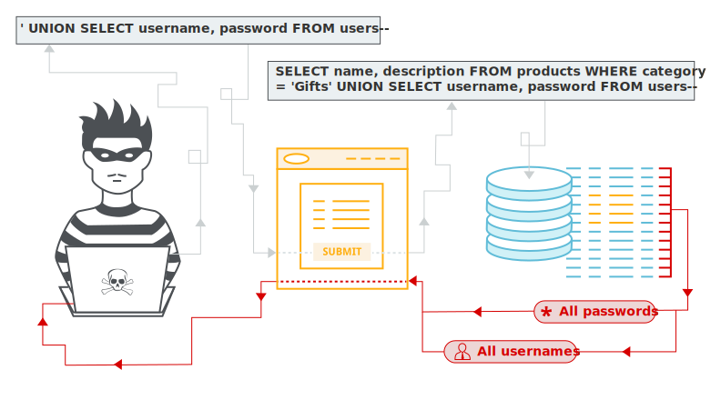
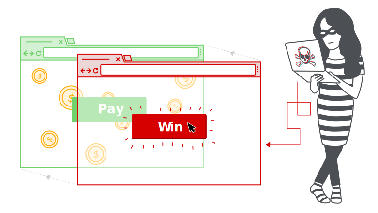

# Guia de estudos para Web Hacking \[2021\]

## Apresentação

  

Sabe-se que a demanda por profissionais de segurança da informação está cada vez maior e que há a falta de profissionais qualificados. Os conteúdos dispersos confundem estudantes que querem aprender ou, muitas vezes, por ser um ramo novo, há um desconhecimento da área.

Somente em 2021, ataques hackers já atingiram US$ 6 trilhões em prejuízos, dinheiro que poderia estar sendo investido em avanços tecnológicos, segurança ou educação. Ataques hackers a hospitais, usinas nucleares e grandes estruturas podem acabar em tragédias, gerando perda de vidas.

Assim, o objetivo desse projeto é orientar o que os estudantes interessados em web hacking devem aprender, a fim de ajudar a mitigar a falta desses profissionais no mercado.

O método empregado é a criação de um website que faz a indexação de materiais didáticos, gratuitos e de qualidade sobre web hacking, o qual os estudantes usarão como um guia em seus estudos de segurança da informação, sendo eles materiais em inglês e em português.

O estudante e autor do projeto, Benjamin Walter, segue essa metodologia e, atualmente, trabalha na área de segurança de informação, encontrando e reportando, eticamente, vulnerabilidades para grandes empresas como Facebook, Shopify, Mercado Livre, CS Money, Avast, Google, Discord e outros programas de recompensas por vulnerabilidades (privados).

## Tabela de conteúdos

- [Apresentação](#apresentação)
- [Tabela de conteúdos](#tabela-de-conteúdos)
- [Introdução](#introdução)
  - [O que é web hacking?](#o-que-é-web-hacking)
  - [Ser hacker é ser criminoso?](#ser-hacker-é-ser-criminoso)
  - [Por que ser um hacker?](#por-que-ser-um-hacker)
    - [Curiosidade](#curiosidade)
    - [Diversão](#diversão)
    - [Desafio](#desafio)
    - [Liberdade](#liberdade)
    - [Dinheiro](#dinheiro)
  - [O inglês é essencial!](#o-inglês-é-essencial)
- [O que você precisa saber antes de começar no web hacking?](#o-que-você-precisa-saber-antes-de-começar-no-web-hacking)
  - [Lógica de programação](#lógica-de-programação)
  - [OAC - Organização e arquitetura de computadores](#oac---organização-e-arquitetura-de-computadores)
  - [C/C++](#cc)
  - [HTML - HyperText Markup Language](#html---hypertext-markup-language)
  - [CSS - Cascading Style Sheets](#css---cascading-style-sheets)
  - [Javascript](#javascript)
  - [PHP - Hypertext Preprocessor](#php)
  - [MySQL](#mysql)
  - [CORS](#cors)
  - [Redes](#redes)
  - [Linux](#linux)
  - [Python ou BASH](#python-ou-bash)
- [Vulnerabilidades](#vulnerabilidades)
  - [DOS](#dos)
  - [SQL Injection](#sql-injection)
  - [XSS](#xss)
  - [CSRF](#csrf)
  - [IDOR](#idor)
  - [SSRF](#ssrf)
  - [XXE](#xxe)
  - [Race Condition](#race-condition)
  - [Git Exposed](#git-exposed)
  - [CRLF](#crlf)
  - [LFI e RFI](#lfi-e-rfi)
  - [Open Redirect](#open-redirect)
  - [NoSQL Injection](#nosql-injection)
  - [Unrestricted File Upload](#unrestricted-file-upload)
  - [Dependency Confusion](#dependency-confusion)
  - [Subdomain Takeover](#subdomain-takeover)
  - [Insecurity Deserialization](#insecurity-deserialization)
  - [Request Smuggling](#request-smuggling)
  - [Clickjacking](#clickjacking)
  - [Cache Poisoning](#cache-poisoning)
- [Reconhecimento do alvo***](#)  <!-- Ver a just another recon guide -->
  - [Enumeração de subdomínos](#)
  - [Enumeração de portas](#)
  - [Google dork](#)
  - [Crawling](#)
- [ Ferramentas***](#) <!-- Dar um ls na minhas tools. Pesquisar por tools usadas no pentest -->
  - [ BurpSuite](#)
  - [ Sqlmap](#)
  - [ amass](#)
  - [ nmap](#)
- [Bug bounty***](#)
  - [Como participar](#)
  - [Plataformas](#)
- [CTF***](#)
  - [Como participar](#)
  - [Plataformas](#)
- [Pentest***](#)
  - [Como começar no pentest](#)
  - [Certificações](#)
- [Participe de comunidades de cyber segurança](#participe-de-comunidades-de-cyber-segurança)
- [Ebooks e livros que vão te ajudar](#ebooks-e-livros-que-vão-te-ajudar)
- [A estrada não acaba aqui](#a-estrada-não-acaba-aqui)
  - [Outras falhas/vulnerabilidades que você pode se aprofundar](#outras-falhasvulnerabilidades-que-você-pode-se-aprofundar)
  - [Aprenda outras tecnologias](#aprenda-outras-tecnologias)
  - [Onde se informar sobre novas vulnerabilidades e se manter atualizado](#onde-se-informar-sobre-novas-vulnerabilidades-e-se-manter-atualizado)
- [Licença](#licença)
- [Fontes](#fontes)

## Introdução

### O que é web hacking?

Web Hacking são as atividades que procuram comprometer websites, seja obtendo controle completo sobre o website, vazando informações confidenciais ou tornando os  recursos do alvo indisponíveis (Ataque de negação de serviços).

### Ser hacker é ser criminoso?

Ao contrário do que muitos pensam, ser hacker não é ser criminoso. É verdade, muitos hackers usam seu conhecimento para o mal, afim de tirar vantagens para si mesmo. Porém, nesse projeto, estaremos abordando somente o hacking ético, o tipo que você tem permissão para hackear.

### Por que ser um hacker?

#### Curiosidade

 

Essa é, provavelmente, a porta de entrada para o mundo dos hackers: um desejo quase incontrolável de investigar, de entender algo. Durante a infância, muitos quebravam os próprios brinquedos, apenas para descobrir como eles funcionavam. Desmontavam partes, encaixavam com pedaços de outros brinquedos, modificavam, criavam algo novo.

No mundo dos computadores, isso funciona da mesma forma. É a curiosidade que move o hacker a entender como um software é construído. Com isso, eles aprendem a programar, estudando linguagens de programação e construindo seus próprios programas. Melhor ainda, eles adquirem um conhecimento muito mais amplo do funcionamento de um programa de computador, possibilitando a exploração de falhas e bugs.

Muitas vezes, essa também é a motivação para a invasão de sistemas online: apenas conferir como isso é possível, descobrir quais são os passos necessários.

#### Diversão

Outro fator que conta muito para o hacker é a diversão. Antes de qualquer coisa, o hacker tem que gostar do que está fazendo e se divertir com aquilo. Caso contrário, ele não se dedicará tanto quanto gostaria.

#### Desafio

O hacker precisa se sentir desafiado, instigado a prosseguir com a ação. Muitas vezes essas pessoas agem sem motivação, apenas para perceberem que algo é possível e que eles conseguem fazer. Hackers gostam de resolver problemas. Quanto mais complexos esses problemas, melhor. Diga a um hacker que algo é impossível de ser feito e ele vai tentar até conseguir.

#### Liberdade

Hackers gostam de explorar os limites de tecnologias e equipamentos e não querem ficar limitados ao uso imposto pela indústria ou fabricante de um dispositivo.

#### Dinheiro

Trabalhar como pentester ou bug bounty hunter pode gerar uma grana legal. Fazer uma empresa que realiza pentest pode ser um negócio muito lucrativo. Muitas vezes, para um pentest que dura poucos dias, podem ser cobrados valores maiores que USD $50,000.00. Para isso, você tem que ser bom, claro, ter certificações e experiência na área. Bug bounty hunter é algo super lucrativo também: as empresas pagam em dólar, valores que variam entre $50 e $50k, dependendo da vulnerabilidade e da empresa em que foi encontrada a falha.

### Por que uma empresa contrataria um hacker?

Uma falha de segurança pode ser catastrófica para uma empresa. Uma empresa só abre bug bounty público/privado quando tem certeza de que não consegue encontrar nenhuma vulnerabilidade em seu sistema, depois de pagar por pentesters e ter vários analistas de segurança da informação analisando os códigos fontes. O pentest ocorre antes do bug bounty. As empresas pagam para que pentester testem a aplicação delas, à procura de vulnerabilidades.

### Você não precisa ser um gênio para aprender hacking

Na real, isso demora e exige dedicação. Às vezes, você não entende o que o instrutor está falando e tem que pesquisar sobre um assunto, então descobre que tem ainda mais para aprender.

### O inglês é essencial

99% dos conteúdos estão em inglês. Não há como fugir. Seus reportes (de vulnerabilidades) serão, em suma, todos em inglês. Você não precisa ser fluente, mas um inglês técnico dá conta legal. Se você conseguir ler livros em inglês, melhor ainda.

Tem um podcast de que eu gosto muito, é o [Inglês do Zero](https://podcasts.google.com/feed/aHR0cHM6Ly9mZWVkcy5zb3VuZGNsb3VkLmNvbS91c2Vycy9zb3VuZGNsb3VkOnVzZXJzOjMzNzMxMDg5My9zb3VuZHMucnNz/episode/dGFnOnNvdW5kY2xvdWQsMjAxMDp0cmFja3MvMTE0MjIzNDA1OQ).
Existe outro podcast interessante, o [podcast da BBC](https://www.bbc.co.uk/programmes/p02pc9zn/episodes/downloads), porém é mais avançado.
Você também pode fazer um curso online gratuito. Inglês não é algo difícil de aprender, com o tempo você pega. Ouça e veja análises de músicas em inglês.
Veja vídeos do youtube em inglês \[são muito bons\]
Use o google translator sempre que necessário, não é vergonha nenhuma, ninguém é um dicionário.

## O que você precisa saber antes de começar no web hacking?

Você precisa de um conhecimento aprofundado em como computadores funcionam, gerenciamento de memória, programação front-end e back-end, redes (como os computadores se comunicam) e protocolos.

### Lógica de programação

Lógica de programação é básico, o nome é auto explicativo. Algo que todo o programador já teve que estudar. Não pule esta etapa.
[Curso completo](https://www.cursoemvideo.com/curso/curso-de-algoritmo/)

### OAC - Organização e arquitetura de computadores

Esta matéria vai te ensinar como computadores funcionam e um pouco da história destas máquinas (também é importante aprender)

[Curso da UNIVESP](https://www.youtube.com/watch?v=HgA-oXOV7kI&list=PLxI8Can9yAHdG-xUDj6i-HGB7IAsAU-t1&ab_channel=UNIVESP)

[Livro e-Tec Brasil](https://redeetec.mec.gov.br/images/stories/pdf/eixo_infor_comun/tec_inf/081112_org_arq_comp.pdf), super interessante para quem quer se aprofundar - e vale a pena se aprofundar

### C/C++

**C ou C++ vão te dar as bases da programação**. Não comece por Python, Javascript ou qualquer outra linguagem interpretada. Comece por C ou C++, linguagens bem documentadas, compiladas, com um nível de abstração menor.

[Um curso bastante completo de C++](https://www.youtube.com/watch?v=nUQKr-ey86Y&list=PLx4x_zx8csUjczg1qPHavU1vw1IkBcm40&ab_channel=CFBCursos), um pouco antigo, porém não é problema.

[Outro curso bastante completo de C](https://www.youtube.com/watch?v=FH7YrE0RjWE&list=PLesCEcYj003SwVdufCQM5FIbrOd0GG1M4&ab_channel=eXcript)

[Outro curso bastante completo de C++](https://www.youtube.com/watch?v=5W9YsbqnX0U&list=PLesCEcYj003QTw6OhCOFb1Fdl8Uiqyrqo&ab_channel=eXcript)

[Curso de C da bóson treinamento, mais básico, mas muito bem feito](https://www.youtube.com/playlist?list=PLucm8g_ezqNqzH7SM0XNjsp25AP0MN82R)

### HTML - HyperText Markup Language

HTML é uma linguagem de marcação utilizada na construção de páginas na Web. Documentos HTML podem ser interpretados por navegadores. Essencial o estudo e conhecimento desta tecnologia.

[Curso de html, css e js do curso em vídeo](https://www.cursoemvideo.com/curso/html5/)

Curso de html5 e css, um pouco mais antigo: 
 [modulo 1](https://www.cursoemvideo.com/curso/html5-css3-modulo1/)
 [modulo 2](https://www.cursoemvideo.com/curso/curso-html5-e-css3-modulo-2-de-5-40-horas/)

### CSS - Cascading Style Sheets

A tecnologia deve ser estudada junto ao HTML. CSS é responsável por dar beleza à página, assim como a compatibilidade da página em telas com tamanhos diferentes. Os mesmo cursos de HTML compreendem o CSS;

[Curso de html, css e js do curso em vídeo](https://www.cursoemvideo.com/curso/html5/)

Curso de html e css, um pouco mais antigo: 
 [modulo 1](https://www.cursoemvideo.com/curso/html5-css3-modulo1/)
 [modulo 2](https://www.cursoemvideo.com/curso/curso-html5-e-css3-modulo-2-de-5-40-horas/)

### Javascript

A linguagem de programação usada em websites, interpretada pelo seu navegador. Essencial a aprendizagem (após o HTML).
 [Curso de javascript](https://www.cursoemvideo.com/curso/javascript/)

### PHP

Linguagem de programação interpretada. Normalmente é utilizada com back-end de websites. Recomendo que estude bastante esta parte web, faça vários projetos (CRUD, sistemas de autenticações envolvendo banco de dados mysql, sistemas de permissões, autenticação por sessões, autenticação por JWT, websockets, autenticação por oauth, integração com o google recaptcha, integração com sistemas de pagamentos como paypal, sistemas de chats, sistemas com verificações e envios de emails, integração com gravatar, e-commerces, etc.)

Você provavelmente vai querer aprender frameworks como laravel e bootstrap.
 [Aprenda sobre cookies](https://developer.mozilla.org/pt-BR/docs/Web/HTTP/Headers/Set-Cookie): o que são as propriedades 'paths', 'domains','expiration', etc.

Neste momento, você já tem uma boa base em computadores (pelo curso de OAC), programação (por ter feito os cursos de C/C++ e lógica) e desenvolviment front-end (cursos de html, css e javascript), portanto, PHP não será nenhum bixo de 7 cabeças. Você deve fazer muitos projetos nesse estágio.

DICA: crie um github, aprenda git e coloque seus projetos. Github, muitas vezes, vale mais do que (ou pode ser considerado) um currículo.

 [Curso de PHP Básico](https://www.cursoemvideo.com/curso/php-basico/)

Recomendo a leitura da documentação para maior aprofundamento na linguagem.

### MySQL

O MySQL é um sistema de gerenciamento de banco de dados, que utiliza a linguagem SQL como interface. É atualmente um dos sistemas de gerenciamento de bancos de dados mais populares.
Basicamente ele vai armazenar informações para você de forma confiável, sabendo que não haverão perdas de dados. É simples, você consegue aprender o básico em semanas. Vale muito a pena aprender sobre. Integre com PHP.

 [Ótimo curso, cobre o básico e intermediário](https://www.cursoemvideo.com/curso/mysql)
 [Curso completíssimo, recomendo este](http://www.bosontreinamentos.com.br/curso-completo-de-mysql/)

### Git e GitHub

Não posso deixar de fora essas duas tecnologias incríveis, que serão de extrema importância na sua jornada de cyber security.
 [Curso de Git e GitHub](https://www.cursoemvideo.com/curso/curso-de-git-e-github/) Pode parecer bobo, mas vale a pena fazer. São ferramenta extremamete utilizadas e requisitadas no mercado.

Recomendo também a leitura do E-book disponibilizado pelo site oficial do git.

### Redes

Redes é o estudo de como os computadores se comunicam, quais protocolos utilizam.
Aprenda bem os protocolos: HTTP, UDP E TCP. Não deixe de estudar o modelo OSI, modelo TCP/IP e DNS.

Aprenda sobre [load balance](https://www.eveo.com.br/blog/load-balance/),   
[reverse proxies](https://www.avast.com/pt-br/c-what-is-a-reverse-proxy),   
[firewall](https://www.cisco.com/c/pt_br/products/security/firewalls/what-is-a-firewall.html) e   [WAF](https://www.gocache.com.br/waf/).

[Curso mais completinho](https://cursa.app/pt/curso/redes-com-boson)
[Curso introdutório](https://www.cursoemvideo.com/curso/redes-de-computadores/)

### CORS

Cross-Origin Resource Sharing (CORS), tem a ver com o sistema de permissões que uma página do navegador tem de acessar páginas de outros domínios.

Recomendo a leitura da [documentação](https://developer.mozilla.org/pt-BR/docs/Web/HTTP/CORS)
Não precisa se apegar a aprender muito bem isso. No momento em que você aprender sobre a vulnerabilidade XSS, você aprenderá na prática, porém é importantíssimo saber que existe.

### Linux

Linux é um (core do) sistema operacional muito conhecido, open source. Recomendo a instalação de uma distro em dual boot na sua máquina, caso já não o tenha. Muitas ferramentas para pestest são feitas em Linux. Muitos servidores usam linux. Estude sobre linux :)

[Curso introdutório, mais fraquinho, recomendo o de baixo](https://www.cursoemvideo.com/curso/linux/)
[Curso de linux, ótimo, recomendo](https://www.youtube.com/playlist?list=PLucm8g_ezqNp92MmkF9p_cj4yhT-fCTl7)

## Vulnerabilidades

Como dito antes, o inglês é essencial. Nesta parte, praticamente todas as explicações das vulnerabilidades estão em inglês, por isso, não se impressione caso não encontrar artigos em português.

<!-- LEMBRAR DE COLOCAR IMAGENS E EMOJIS E TUDO OOF; CONTINUAR DAQUI -->

### DOS

O ataque de negação de serviço (Denial of Service - DoS) tem como objetivo tornar um recurso (site, aplicativo, servidor) indisponível para a finalidade para a qual foi projetado. Existem muitas maneiras de tornar um serviço indisponível para usuários legítimos: manipulando pacotes de rede, vulnerabilidades de programação, lógicas ou de manipulação de recursos, entre outras. Se um serviço receber um grande número de solicitações, ele pode deixar de estar disponível para usuários legítimos. 

[owasp.org](https://owasp.org/www-community/attacks/Denial_of_Service) 
[paloaltonetworks.com](https://www.paloaltonetworks.com/cyberpedia/what-is-a-denial-of-service-attack-dos)

### SQL Injection

A injeção de SQL (SQL Injection) é uma vulnerabilidade de segurança da web que permite que um invasor interfira nas consultas que um aplicativo faz ao seu banco de dados. Geralmente, permite que um invasor visualize dados que normalmente não é capaz de recuperar. Isso pode incluir dados pertencentes a outros usuários ou quaisquer outros dados que o próprio aplicativo é capaz de acessar. Em muitos casos, um invasor pode modificar ou excluir esses dados, causando alterações persistentes no conteúdo ou comportamento do aplicativo.

[owasp.org](https://owasp.org/www-community/attacks/SQL_Injection) 
[portswigger.net](https://portswigger.net/web-security/sql-injection)

### XSS

Ataques Cross-Site Scripting (XSS) são um tipo de injeção de código, em que scripts maliciosos são injetados em sites benignos e confiáveis. Os ataques XSS ocorrem quando um invasor usa um aplicativo da web para enviar código malicioso, geralmente na forma de um script do lado do navegador, para um usuário final diferente. As falhas que permitem que esses ataques sejam bem-sucedidos são bastante difundidas e ocorrem em qualquer lugar que um aplicativo da web use a entrada de um usuário dentro da saída que gera, sem validá-la ou codificá-la.

[owasp.org](https://owasp.org/www-community/attacks/xss/) 
[portswigger.net](https://portswigger.net/web-security/cross-site-scripting)

### CSRF

Cross-Site Request Forgery (CSRF) é um ataque que força um usuário final a executar ações indesejadas em um aplicativo da web no qual ele está autenticado no momento. Com um pouco de ajuda de engenharia social (como enviar um link por e-mail ou chat), um invasor pode enganar os usuários de um aplicativo da web para que executem ações à escolha do invasor. Se a vítima for um usuário normal, um ataque CSRF bem-sucedido pode forçar o usuário a realizar solicitações de alteração de estado, como transferência de fundos, alteração de endereço de e-mail e assim por diante. Se a vítima for uma conta administrativa, o CSRF pode comprometer todo o aplicativo da web.

[owasp.org](https://owasp.org/www-community/attacks/csrf/) 
[portswigger.net](https://portswigger.net/web-security/csrf)

### IDOR

A 'referência direta a objetos inseguros' (IDOR - Insecure direct object references) é um tipo de vulnerabilidade de controle de acesso que surge quando um aplicativo usa a entrada fornecida pelo usuário para acessar objetos diretamente, sem verificar se o usuário tem permissão para tal. O termo IDOR foi popularizado por sua aparição no OWASP 2007 Top Ten. No entanto, é apenas um exemplo de muitos erros de implementação de controle de acesso que podem fazer com que os controles de acesso sejam contornados. Vulnerabilidades de IDOR são mais comumente associadas ao 'aumento de privilégio horizontal', mas também podem surgir em relação ao aumento de privilégio vertical.

[owasp.org](https://cheatsheetseries.owasp.org/cheatsheets/Insecure_Direct_Object_Reference_Prevention_Cheat_Sheet.html) 
[portswigger.net](https://portswigger.net/web-security/access-control/idor) 
[owasp.org pdf](https://owasp.org/www-chapter-ghana/assets/slides/IDOR.pdf)

### SSRF

A 'falsificação de solicitação do lado do servidor' (SSRF - Server-side request forgery) é uma vulnerabilidade de segurança da web que permite que um invasor induza o servidor a fazer solicitações HTTP (ou outros tipos) para um domínio de escolha do invasor.

Em um ataque SSRF típico, o invasor pode fazer com que o servidor estabeleça uma conexão apenas com serviços internos dentro da infraestrutura da organização. Em outros casos, eles podem forçar o servidor a se conectar a sistemas externos arbitrários, potencialmente vazando dados confidenciais, como credenciais de autorização.

[owasp.org](https://owasp.org/www-community/attacks/Server_Side_Request_Forgery) 
[portswigger.net](https://portswigger.net/web-security/ssrf) 
[owasp.org ler depois, explicação mais completa](https://owasp.org/Top10/A10_2021-Server-Side_Request_Forgery_%28SSRF%29/)  

Testes suas habilidades de SSRF [aqui](https://github.com/WebGoat/WebGoat).

### XXE

Um 'ataque de entidade externa' (XXE - External Entity attack) é um tipo de ataque contra um aplicativo que analisa a entrada XML. Este ataque ocorre quando a entrada XML contendo uma referência a uma entidade externa é processada por um analisador XML com configuração fraca. Este ataque pode levar à divulgação de dados confidenciais, negação de serviço, falsificação de solicitação do lado do servidor, varredura de porta da perspectiva da máquina onde o analisador está localizado e outros impactos no sistema.

[owasp.org](https://owasp.org/www-community/vulnerabilities/XML_External_Entity_(XXE)_Processing) 
[portswigger.net](https://portswigger.net/web-security/xxe) 
[owasp.org ler depois, explicação mais completa](https://cheatsheetseries.owasp.org/cheatsheets/XML_External_Entity_Prevention_Cheat_Sheet.html)

### Race Condition

Uma 'condição de corrida' (Race Condition) é uma falha que produz um resultado inesperado quando o tempo das ações afeta outras ações. Um exemplo pode ser visto em um aplicativo multithread em que as ações estão sendo executadas nos mesmos dados. As condições da corrida, por sua própria natureza, são difíceis de testar.

[Explicação de race condition](https://www.securitycompassadvisory.com/blog/race-condition-web-applications/) 
[Explicação e prevenção de race conditions](https://blog.sqreen.com/preventing-race-condition-vulnerabilities-in-your-organization/) 
[Artigo de medium](https://medium.com/wearesinch/exploiting-and-fixing-a-race-condition-problem-12976baa952c) 
[owasp.org, pdf bem completo](https://owasp.org/www-pdf-archive/OWASP_NZDay_2011_BrettMoore_ConcurrencyVulnerabilities.pdf) 
[Na prática](https://book.hacktricks.xyz/pentesting-web/race-condition) 
[Procurando, e encontrando, race conditions](https://krevetk0.medium.com/how-to-check-race-conditions-in-web-applications-338f73937992)

### Git Exposed

Git exposed ou git exposto, em português, é uma falha que, caso a pasta .git esteja exposta, é possível que um atacante tenha acesso ao código fonte da aplicação.

[Artigo medium. em português](https://gabrieldkgh.medium.com/git-exposed-encontrando-manualmente-e-automatizado-como-explorar-como-arrumar-a-falha-eaa3ee98fe8c) 
[Video, em portuegês, de exploração da vulnerabilidade, em um CTF](https://www.youtube.com/watch?v=k_wLZ-pMTOM&ab_channel=GuiaAn%C3%B4nimaCTF)
[Artigo código fonte exposto](https://blog.devgenius.io/source-code-disclosure-via-exposed-git-folder-24993c7561f1)

### CRLF

O termo CRLF se refere a 'Carriage return' (ASCII 13, \r) 'Line Feed' (ASCII 10, \n). Eles são usados para observar o encerramento de uma linha, no entanto, tratada de forma diferente nos sistemas operacionais populares de hoje. Por exemplo: no Windows, um CR e LF são obrigados a observar o final de uma linha, enquanto no Linux / UNIX um LF é necessário apenas. No protocolo HTTP, a sequência CR-LF é sempre usada para encerrar uma linha.

Um ataque de injeção de CRLF ocorre, geralmente, quando um usuário consegue enviar um CRLF para o servidor e há uma reflexão do conteúdo no cabeçalho, permitindo que haja a injeção de novos headers na resposta. Essa vulnerabilidade pode ser encadeada com um Cache Poisoning.

Existem mais dois usos comuns de ataques de injeção CRLF: envenenamento de log e divisão de resposta HTTP.

[owasp.org](https://owasp.org/www-community/vulnerabilities/CRLF_Injection) 
[acunetix.com](https://www.acunetix.com/websitesecurity/crlf-injection/) 
[greysec.net](https://greysec.net/showthread.php?tid=7022)

### LFI e RFI

Inclusão de arquivo remoto (RFI - Remote File Inclusion) e Inclusão de arquivo local (LFI - Local File Inclusion) são vulnerabilidades  freqüentemente encontradas em aplicativos da web mal escritos. Essas vulnerabilidades ocorrem quando um aplicativo da web permite que o usuário envie entrada em arquivos ou faça upload de arquivos para o servidor.

As vulnerabilidades de LFI permitem que um invasor leia (e às vezes execute) arquivos na máquina da vítima. Isso pode ser muito perigoso porque se o servidor da web estiver mal configurado e executando com altos privilégios, o invasor pode obter acesso a informações confidenciais. Se o invasor conseguir colocar código no servidor da Web por outros meios, ele poderá executar comandos arbitrários.

Vulnerabilidades de RFI são mais fáceis de explorar, mas menos comuns. Em vez de acessar um arquivo na máquina local, o invasor pode executar o código hospedado em outro website.

[offensive-security.com FILE INCLUSION VULNERABILITIES](https://www.offensive-security.com/metasploit-unleashed/file-inclusion-vulnerabilities/) 
[neuralegion.com Local File Inclusion (LFI): Understanding and Preventing LFI Attacks](https://www.neuralegion.com/blog/local-file-inclusion-lfi/) 
[netsparker.com Local File Inclusion (LFI)](https://www.netsparker.com/blog/web-security/local-file-inclusion-vulnerability/)
[imperva.com Remote file inclusion (RFI)](https://www.imperva.com/learn/application-security/rfi-remote-file-inclusion/)

### Open Redirect

Open Redirect são possíveis quando um aplicativo da web aceita entradas de dados não confiáveis, que podem fazer com que o servidor redirecione a solicitação para uma outra URL contido na entrada não confiável. Ao modificar a entrada de URL não confiável para um site malicioso, um invasor pode lançar um esquema de phishing e roubar as credenciais do usuário.

[owasp.com](https://cheatsheetseries.owasp.org/cheatsheets/Unvalidated_Redirects_and_Forwards_Cheat_Sheet.html) 
[treinaweb.com.br, em português](https://www.treinaweb.com.br/blog/open-redirect-vulnerabilidade-de-redirecionamento-aberto)

### NoSQL Injection

Uma vulnerabilidade de injeção NoSQL é um erro em um servidor da web que usa um banco de dados NoSQL (normalmente MongoDB). Esse problema de segurança do aplicativo da web permite que uma parte mal-intencionada ignore a autenticação, extraia dados, modifique dados ou até mesmo obtenha controle completo sobre o aplicativo. Ataques de injeção de NoSQL são o resultado de uma falta de sanetização de dados.

Recomendo o estudo de Node JS, MongoDB, Mongoose e Express, caso de deseje se aprofundar em NoSQL Injection.

[owasp.org/www-pdf-archive](https://owasp.org/www-pdf-archive/GOD16-NOSQL.pdf) 
[acunetix.com](https://www.acunetix.com/blog/web-security-zone/nosql-injections/) 
[netsparker.com](https://www.netsparker.com/blog/web-security/what-is-nosql-injection/) 
[book.hacktricks.xyz](https://book.hacktricks.xyz/pentesting-web/nosql-injection)

### Unrestricted File Upload

Os uploads de arquivos representam um risco significativo para os servidores. O primeiro passo em muitos ataques é fazer upload de código malicioso ao sistema alvo. Então, o ataque só precisa encontrar uma maneira de fazer com que o código seja executado. Usar um upload de arquivo ajuda o invasor a realizar a primeira etapa.

As consequências do upload irrestrito de arquivos podem variar, incluindo controle completo do sistema, um sistema de arquivos ou banco de dados sobrecarregado, ataques de encaminhamento para sistemas back-end, ataques do lado do cliente ou simples desfiguração. Depende do que o aplicativo faz com o arquivo carregado e especialmente onde ele está armazenado.

Na verdade, existem duas variações do problemas. O primeiro é com os metadados do arquivo, como o caminho e o nome do arquivo. Geralmente, eles são fornecidos pelo transporte, como a codificação de várias partes HTTP. Esses dados podem induzir o aplicativo a sobrescrever um arquivo crítico ou armazenar o arquivo em um local incorreto.

A outra variação do problema é com o tamanho ou conteúdo do arquivo. A gama de problemas aqui depende inteiramente da finalidade do arquivo.

[owasp.org](https://owasp.org/www-community/vulnerabilities/Unrestricted_File_Upload) 
[netsparker.com](https://www.netsparker.com/web-vulnerability-scanner/vulnerabilities/unrestricted-file-upload/) 
[acunetix.com](https://www.acunetix.com/vulnerabilities/web/unrestricted-file-upload/) 
[knowledge-base.secureflag.com](https://knowledge-base.secureflag.com/vulnerabilities/unrestricted_file_upload/unrestricted_file_upload_vulnerability.html)

### Dependency Confusion

Recomendo que você conheça gerenciadores de pacotes, como pip, gems ou npm antes de começar a testar por esta vulnerabilidade.

O conceito da vulnerabilidade Dependency Confusion é que, por causa de como os gerenciadores de pacotes são construídos, se você criar uma biblioteca maliciosa pública com o mesmo nome de uma biblioteca interna da empresa e com uma versão maior, quando o programador executar o comando para atualizar as bibliotecas (ou algo similar), o gerenciador de pacotes irá baixar a sua biblioteca maliciosa permitindo, na grande maioria das vezes, execução remota de código.

[Artigo da primeira pessoa que detectou e explorou dependency confusion](https://medium.com/@alex.birsan/dependency-confusion-4a5d60fec610) 
[braziljs.org, em português](https://www.braziljs.org/p/dependency-confusion)

### Subdomain Takeover

Para entender esta vulnerabilidade, primeiro é necessário entender o que são CNAMEs, portanto, tenha certeza de ter entendido isto muito bem nas aulas de redes.

As tomadas de controle de subdomínio (Subdomain Takeover) são uma ameaça comum e de alta gravidade para as organizações que criam e excluem muitos recursos regularmente. Uma tomada de controle de subdomínio pode ocorrer quando um registro DNS indicar um recurso desprovisionado do, por exemplo, Azure. Esses registros DNS também são conhecidos como entradas "DNS pendentes". Os registros CNAME são particularmente vulneráveis a essa ameaça. As invasões de subdomínio permitem que os atores mal-intencionados redirecionem o tráfego destinado ao domínio de uma organização a um site que executa atividades mal-intencionadas.

[www.honeybadger.io Explicação + cenário de ataque real + mitigação](https://www.honeybadger.io/blog/subdomain-takeover/)
[hackerone.com guide-subdomain-takeovers](https://www.hackerone.com/application-security/guide-subdomain-takeovers)
[youtube.com Palestra do hacker brasileiro Ricardo Iramar, em português](https://www.youtube.com/watch?v=u_nXZ4YRcto&ab_channel=Roadsec)

### Insecurity Deserialization

A desserialização insegura (Insecurity Deserialization) ocorre quando os dados controláveis pelo usuário são desserializados por um site. Isso permite que um invasor manipule objetos serializados para passar dados prejudiciais ao código do aplicativo.

[portswigger.net](https://portswigger.net/web-security/deserialization) 
[acunetix.com](https://www.acunetix.com/blog/articles/what-is-insecure-deserialization/) 
[owasp.org](https://owasp.org/www-project-top-ten/2017/A8_2017-Insecure_Deserialization)

### Request Smuggling

O contrabando de solicitações HTTP (Request Smuggling) é uma técnica para interferir na maneira como um site da Web processa sequências de solicitações HTTP recebidas de um ou mais usuários. Vulnerabilidades Request Smuggling costumam ser de natureza crítica, permitindo que um invasor ignore os controles de segurança, obtenha acesso não autorizado a dados confidenciais e comprometa diretamente outros usuários de aplicativos.

[portswigger.net](https://portswigger.net/web-security/request-smuggling) 
[owasp.org testando request smuggling](https://owasp.org/www-project-web-security-testing-guide/latest/4-Web_Application_Security_Testing/07-Input_Validation_Testing/15-Testing_for_HTTP_Splitting_Smuggling)

### Clickjacking

Clickjacking é um ataque baseado em interface em que um usuário é induzido a clicar em um conteúdo acionável em um site oculto, clicando em algum outro conteúdo em um site falso.

Usando uma técnica semelhante, os pressionamentos de teclas também podem ser sequestrados. Com uma combinação cuidadosamente elaborada de css, iframes e caixas de texto, um usuário pode ser levado a acreditar que está digitando a senha em seu e-mail ou conta bancária, mas em vez disso está digitando em um quadro invisível controlado pelo invasor.

[owasp.org](https://owasp.org/www-community/attacks/Clickjacking) 
[portswigger.net](https://portswigger.net/web-security/clickjacking)

### Cache Poisoning

O envenenamento do cache da Web (Web Cache Poisoning) é uma técnica avançada pela qual um invasor explora o comportamento de um servidor da Web e do cache para que uma resposta HTTP prejudicial seja servida a outros usuários.

Fundamentalmente, o envenenamento do cache da web envolve duas fases. Primeiro, o invasor deve descobrir como obter uma resposta do servidor back-end que contenha algum tipo de carga (payload) perigoso. Uma vez bem-sucedidos, eles precisam ter certeza de que sua resposta é armazenada em cache e, posteriormente, servida às vítimas pretendidas.

Um cache da web envenenado pode ser um meio devastador de distribuir vários ataques diferentes, explorando vulnerabilidades como XSS, injeção de JavaScript, Open Redirect e assim por diante.

[owasp.org](https://owasp.org/www-community/attacks/Cache_Poisoning) 
[portswigger.net](https://portswigger.net/web-security/web-cache-poisoning)

<!-- Adicionar python ou bash aos pré requisitos -->

## Participe de comunidades de cyber segurança

Discord. Se você ainda não conhece essa plataforma (estilo rede social), está perdendo. Você pode criar uma conta e participar de servidores focados em ethical hacking, sejam eles em português ou inglês.
- [Boitatech](https://www.boitatech.com.br/) Gurizada BR de hacking, bem interessante. \[pt\]
- [Public club](https://discord.gg/2EDuJR3c4K) Tudo que é tipo de hacking ou assunto de tecnologia. Tem bastante gente crânio nesse server. \[en\]
- [Intigriti](https://discord.gg/vdFTaHgz2d) Web Hacking, tutoriais bons \[en\]
- [Hackerone](https://discord.gg/Qqfwmfuav7) Web Hacking, tutoriais bons \[en\]
- [XSS Rat](https://discord.gg/2EDuJR3c4K) Web Hacking e instruções para iniciantes \[en\]
- [InsiderPHP](https://discord.gg/2sFmxQwg4e) Web Hacking e instruções para iniciantes \[en\]
- [Mente Binária](https://menteb.in/discord) Mais focado em low level hacking, mas tem web hacking tbm \[pt\]

## E-books e livros que vão te ajudar

- E-book grátis da [hackerone](https://www.hackerone.com/ethical-hacker/hack-learn-earn-free-e-book): 
- Bug Bounty Bootcamp by Vickie Li
- Bug Hunter Diary
- Hands-On Bug Hunting for Penetration Testers 1st Edition
- The Web Application Hacker's Handbook [Este é realmente muito bom]

## A estrada não acaba aqui

Não. Não acaba mesmo. Todos os dias, dezenas que vulnerabilidades estão sendo descobertas e reportadas (ou não). Se você parar seu estudo, ficará cada dia mais ultrapassado. Lembre-se: se há uma atualização, muito provavelmente, há uma nova falha. Novas tecnologias, cheinhas de vulnerabilidades, estão esperando você.

### Aprenda outras tecnologias

- Node JS e o principais frameworks web
- Laravel
- Templates como handlebars
- Python, Bash e GO (principalmente para criação de ferramentas para encontrar falhas)

### Outras falhas/vulnerabilidades que você pode se aprofundar

 

- SSTI (Server side template injection)
- PP (Prototype pollution)
- RCE (Remote code execution)

### Onde se informar sobre novas vulnerabilidades e se manter atualizado

- Hackctivity da hackerone, bugcrowd, YesWeHack, etc., todas essas plataformas de reportes de vulnerabilidades
- Artigos no medium.com. Tente procurar pelas tags `hacking`, `hackerone`, `cybersec`.
- Twitter. Pode parece meio plot twist, mas o twitter é uma fonte de informação muito boa quando se diz respeito à tecnologia. Muitas vulnerabilidades 0days são compartilhadas lá. Recomendo a criação de uma conta onde você fique cercado nesse universo da cybersec.
- O youtube tem vários hackers muito bons também. Algumas lives lhe ajudarão bastante

## Licença

MIT License. [Leia mais](https://github.com/git/git-scm.com/blob/main/MIT-LICENSE.txt).

## Fontes

- [Hacker roadmap](https://github.com/sundowndev/hacker-roadmap)
- [Dados de ataques hackers](https://olhardigital.com.br/2021/09/12/seguranca/brasil-e-o-5o-pais-em-ataques-de-hackers-contra-empresas)
- [hacker](https://br.malwarebytes.com/hacker/)
- [razões para hackear](https://www.tecmundo.com.br/seguranca/10731-7-razoes-para-hackear.htm)

